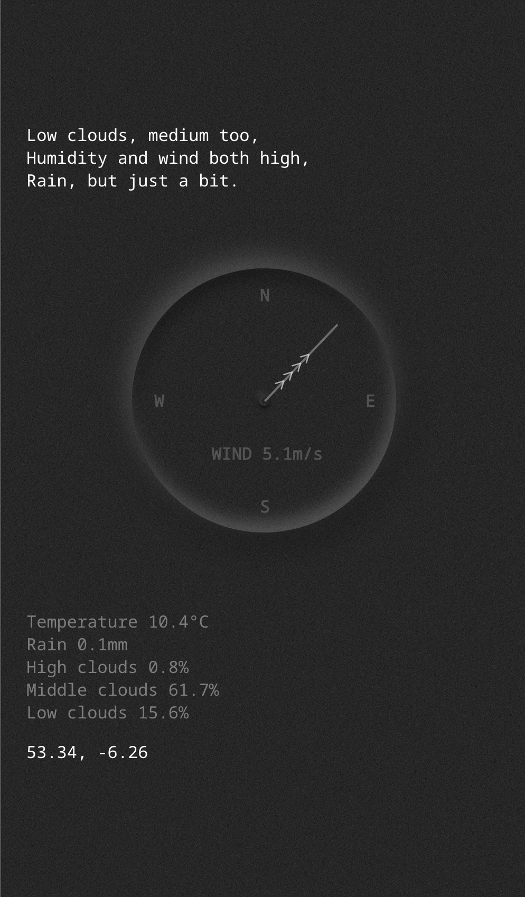

Pages: https://conorluddy.github.io/weather-haiku/

Very simple POC, hits the yr.no API for the weather forecast, summarises it into a smaller string to minimise tokens that ChatGPT needs to process, and then requests that ChatGPT create a Haiku from it.

With ChatGPT's API you pay by the tokens, basically 'words', both sent and received, so while we could ask for the weather forecast as a short fairytale, a Haiku is at least short and sweet.

ChatGPT is spendy, so I'm caching these haiku in AWS DynamoDB based on coordinates and the hour. If one has been generated already for your coordinates (to one decimal place) and for the given hour, then it will be fetched from DynamoDB instead of regenerating from ChatGPT. 

Next steps:

-   [x] Take params for the coordinates
-   [x] Put it on an AWS Lambda
-   [x] Set up API Gateway to proxy calls to the Lambda
-   [x] Make a simple front-end for it
-   [x] Optimise/minimise the weather data being used
-   [x] Cache ChatGPT results per hour x latlon in DynamoDB
-   [ ] CI/CD for putting it on AWS
-   [ ] See if ChatGPT can be initialised with a template, so we can just send comma separated values to further miminise token count
-   [ ] Maybe make an IOS app/widget for it

## Running

In one terminal

```
cd lambda
cargo lambda watch
```

In another

```
cargo lambda invoke weather_haiku --data-ascii '{ "latitude": "53.34", "longitude": "-6.26" }'
```

## Build

```
cargo lambda build --release --arm64 --output-format zip
```

## Deploy

```
cargo lambda deploy --iam-role arn:aws:iam::XXXXXXXXXXXX:role/your-role-here
```

## Credits

[Codrops](https://tympanus.net/codrops/?p=70337) for the cool UI effect, shamelessly stolen for this. See readme in the frontend directory for more.
