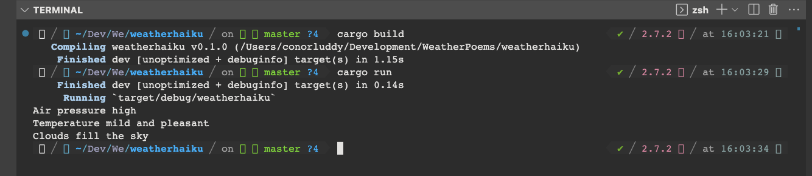

Very simple POC, hits the yr.no API for the weather forecast (hard coded to Dublin at the moment), summarises it into a smaller string to save on the tokens that ChatGPT needs to process, and then requests that ChatGPT create a Haiku from it.

With ChatGPT's API you pay by the tokens, basically 'words', both sent and received, so while we could ask for the weather forecast as a short fairytale, a Haiku is at least short and sweet.

Next steps:
- [ ] Put it on an AWS Lambda
- [ ] CI/CD for putting it on AWS
- [ ] Cache ChatGPT results per timestamp and latlon, in Redis or Dynamo
- [ ] Take params for the coordinates
- [ ] Optimise the weather data being used
- [ ] See if ChatGPT can be initialised with a template, so we can just send comma separated values to further miminise token count
- [ ] Make a simple front-end for it
- [ ] Maybe make an IOS app/widget for it


## Running

In one terminal

```
cd lambda
cargo lambda watch
```

In another 
```
cargo lambda invoke weather_haiku --data-ascii '{ "latitude": "53.34", "longitude": "-6.26" }'
```

## Deployment

```
cargo lambda deploy --iam-role arn:aws:iam::XXXXXXXXXXXX:role/your-role-here
```


